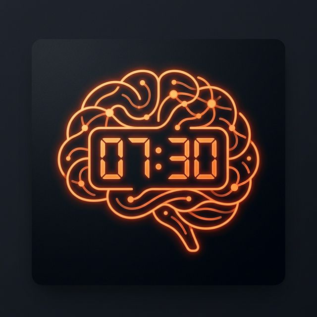
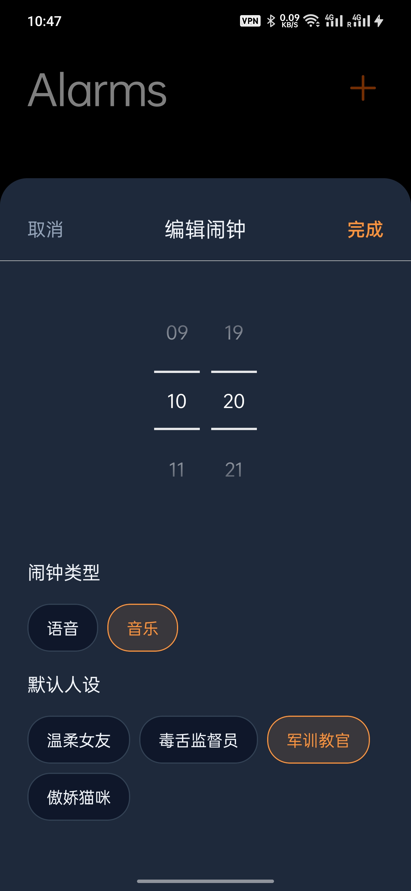

<div align="center">
  
  <h1>⏰ Wake Up Dude</h1>
  <p><strong>A full-stack, cross-platform, and highly aggressive AI cyber-wake-up expert.</strong></p>
  
  [](https://github.com/YOUR-GITHUB-NAME/wake-up-dude/releases)
  [](https://github.com/YOUR-GITHUB-NAME/wake-up-dude/releases)
  [](#architecture)
</div>

<br/>

## 📸 App Screenshots (UI Showcase)

<div align="center">
  
  
  
  
</div>

## 🌟 Vision
Tired of the same old mechanical alarm sounds? **Wake Up Dude** leverages the latest generation of large models (LLM + TTS & Music multimodal dual-engine architecture) to tailor a full 30-second, emotionally charged, and highly impactful "exclusive wake-up service" for you every morning, based on your set time and persona preferences.

**There is only one core philosophy: guaranteeing you wake up instantly in shock, fear, or extreme comfort.**

## 🚀 Features

*   🎙️ **A Thousand Faces Cyber Brain**: Built-in personas like `Extremely Gentle Girlfriend`, `Hysterical & Ruthless Commander`, `Unforgiving Toxic HR`, and more. Additionally, it now supports **Lyria 3 Music Generation** (Epic Symphonies, Heavy Metal, Hans Zimmer style, etc.). The wake-up lines and music generated every day are never repeated.
*   ⚡ **Zero Cold Start Edge Defense**: Completely abandoned the toy-level attempt of local plaintext keys. Adopted **Cloudflare Workers** to take over core traffic, hide Gemini keys, and provide IP daily active rate limiting (max 3 times/day) to perfectly block traffic abuse.
*   🗄️ **SQLite Data Persistence & Cache Lifecycle**: Every interesting scolding session is persisted with a timestamp (e.g., `[13:21] Gentle Girlfriend`) and stored independently in physical tables and sandbox audio files. Supports replay and one-click garbage collection.
*   🖐️ **OCD-Level Interaction (Haptics Vibration)**: Say goodbye to the muscle memory of "click once to stop". Pioneered the abyss-level `<SwipeToStop>` sliding damping interaction lock. You must firmly drag the slider to 85% progress to release it, accompanied by a realistic physics engine haptic feedback, to interrupt the background forced dead loop.
*   ⏰ **True Background Execution**: Migrated to `@notifee/react-native` and Android's `AlarmManager` for native, reliable alarm triggers that wake up the device from deep doze mode with zero-second delay, bypassing system battery optimizations.
*   🐛 **Built-in Debugging System**: Features a persistent SQLite-based logging system to track network errors, VPN disconnections, and alarm lifecycle events, accessible via a dedicated diagnostic dashboard.

## 📥 Download
This project currently provides production-grade `Android APK` installation packages! Completely detached from developer mode, enjoy the immersive wake-up experience purely.

👉 **[Click here to jump to the Releases page to download the latest APK](https://github.com/yrjkqq/wake-up-dude/releases)**

*(Due to the abnormal closeness of the iOS App Store, iPhone users need to clone the code and use Xcode or EAS to self-sign and run on real devices)*

## 🏗️ Architecture Blueprint
> To deeply understand how a fledgling Demo was step-by-step refactored into an anti-abuse, crash-proof, industrial-grade full-stack product, please read the core development chronicle:
> **[📂 PROJECT_PLAN.md](docs/PROJECT_PLAN.md)**

---

## 👨‍💻 Development
If you want to pull down this high-value large model framework to magically alter the personas yourself, or deeply study how the Cloudflare Node.js gateway proxy is written:

```bash
# 1. Clone this crazy codebase
git clone https://github.com/yrjkqq/wake-up-dude.git

# 2. Install frontend heavy artillery dependencies
npm install

# 3. If you want to deploy your own Cloudflare backend fortress
cd cloudflare-worker
npm install
npx wrangler login 
npx wrangler kv:namespace create WAKE_UP_DUDE_KV
npx wrangler secret put GEMINI_API_KEY
npx wrangler deploy

# 4. Attach body armor to the obtained external secure network card (.env.production)
# EXPO_PUBLIC_API_URL=https://<your_worker_domain>

# 5. Take off
npm run start
```

## 📝 License
MIT License. Feel free to use it boldly to launch dimensional strikes on your friends while they are sound asleep.
